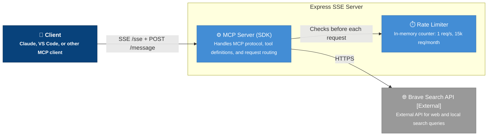

# DevOps Guide — Brave Search MCP Server

This document covers deployment, CI/CD, infrastructure, monitoring, and operational procedures for the Brave Search MCP Server project.

---

## Table of Contents

- [Architecture Overview](#architecture-overview)
- [Environment Setup](#environment-setup)
- [Claude Code MCP Setup](#claude-code-mcp-setup)
- [Build & Deploy](#build--deploy)
- [CI/CD Pipeline](#cicd-pipeline)
- [Environment Variables](#environment-variables)
- [Docker Operations](#docker-operations)
- [Health & Monitoring](#health--monitoring)
- [Security](#security)
- [Incident Response](#incident-response)
- [Release Process](#release-process)

---

## Architecture Overview

The Brave Search MCP Server is a Node.js/TypeScript MCP (Model Context Protocol) server that exposes two search tools via SSE (Server-Sent Events) over an Express HTTP server.



### Key Components

| Component | Description |
|---|---|
| `index.ts` | Entry point — Express server, SSE transport, MCP tool routing |
| `@modelcontextprotocol/sdk` | MCP protocol implementation (SSE transport) |
| Brave Search API | External API for web and local search queries |
| Rate Limiter | In-memory counter (1 req/s, 15,000 req/month) |

### Ports

| Port | Protocol | Purpose |
|---|---|---|
| `3000` | HTTP | Default server port (configurable via `PORT`) |

---

## Environment Setup

### Prerequisites

- **Node.js** >= 22 (Alpine-based in Docker)
- **npm** (bundled with Node.js)
- **Docker** (optional, for containerized deployment)
- **Brave Search API Key** (required — see [README.md](./README.md))

### Local Development

```bash
# Clone and install dependencies
npm install

# Build TypeScript
npm run build

# Start locally (requires BRAVE_API_KEY)
BRAVE_API_KEY=your_key npm start
```

---

## Claude Code MCP Setup

Claude Code (and other MCP-compatible clients) can connect to this server by configuring an MCP servers file. Below are examples for the most common setups.

### Claude Desktop

Add the following to your `claude_desktop_config.json` (typically found at `%APPDATA%\Claude\claude_desktop_config.json` on Windows or `~/Library/Application Support/Claude/claude_desktop_config.json` on macOS):

#### NPX (Recommended for Quick Setup)

```json
{
  "mcpServers": {
    "brave-search": {
      "command": "npx",
      "args": ["-y", "@modelcontextprotocol/server-brave-search"],
      "env": {
        "BRAVE_API_KEY": "YOUR_API_KEY_HERE"
      }
    }
  }
}
```

#### Docker

```json
{
  "mcpServers": {
    "brave-search": {
      "command": "docker",
      "args": ["run", "-i", "--rm", "-e", "BRAVE_API_KEY", "mcp/brave-search"],
      "env": {
        "BRAVE_API_KEY": "YOUR_API_KEY_HERE"
      }
    }
  }
}
```

#### Local Build (Development)

When developing locally, point to your built output:

```json
{
  "mcpServers": {
    "brave-search": {
      "command": "node",
      "args": ["dist/index.js"],
      "env": {
        "BRAVE_API_KEY": "YOUR_API_KEY_HERE"
      }
    }
  }
}
```

> **Note:** On Windows, use `cmd.exe` or `pwsh` as the command if `npx` or `node` are not resolved directly:
> ```json
> {
>   "command": "pwsh",
>   "args": ["-c", "npx -y @modelcontextprotocol/server-brave-search"]
> }
> ```

### VS Code (via `.vscode/mcp.json`)

Create a `.vscode/mcp.json` file in your workspace:

```json
{
  "inputs": [
    {
      "type": "promptString",
      "id": "brave_api_key",
      "description": "Brave Search API Key",
      "password": true
    }
  ],
  "servers": {
    "brave-search": {
      "command": "npx",
      "args": ["-y", "@modelcontextprotocol/server-brave-search"],
      "env": {
        "BRAVE_API_KEY": "${input:brave_api_key}"
      }
    }
  }
}
```

This prompts for the API key securely each time VS Code starts, rather than storing it in plaintext.

### Verifying the Connection

After configuring the MCP server:

1. Restart your MCP client (Claude Desktop, VS Code, etc.)
2. Open a chat session and ask the AI to perform a web search
3. Check server logs for startup confirmation:
   ```
   Brave Search MCP Server running on SSE at port 3000
   ```

---

## Build & Deploy

### Build

```bash
# TypeScript compilation (outputs to dist/)
npm run build
```

### Deploy Options

| Method | Command | Use Case |
|---|---|---|
| **NPX** | `npx -y @modelcontextprotocol/server-brave-search` | Quick testing, no install |
| **Node** | `npm run build && node dist/index.js` | Local / VM deployment |
| **Docker** | `docker build -t mcp/brave-search:latest -f Dockerfile .` | Containerized deployment |

### Docker Run

```bash
docker run -i --rm -e BRAVE_API_KEY=your_key mcp/brave-search:latest
```

---

## CI/CD Pipeline

### GitHub Actions

The project uses GitHub Actions for CI. The workflow is defined in `.github/workflows/ci.yml`.

#### Pipeline Stages

| Stage | Description |
|---|---|
| **Lint** | TypeScript type checking via `tsc --noEmit` |
| **Build** | Full TypeScript compilation (`npm run build`) |
| **Test** | Unit tests (Vitest — planned per [PLAN_AddQueueToBraveWebSearch.md](./docs/AddQueueToBraveWebSearch/PLAN_AddQueueToBraveWebSearch.md)) |
| **Docker Build** | Multi-stage Docker image build validation |

#### Triggering the Pipeline

- Push to `main` or `master` branch
- Pull requests targeting `main`
- Manual dispatch (if configured)

#### Viewing CI Results

Navigate to the **Actions** tab in the GitHub repository to view workflow runs, logs, and artifacts.

---

## Environment Variables

| Variable | Required | Default | Description |
|---|---|---|---|
| `BRAVE_API_KEY` | **Yes** | — | Brave Search API subscription token |
| `MCP_TRANSPORT` | No | `stdio` | Transport mode: `stdio` (default) or `sse` |
| `PORT` | No | `3000` | HTTP server listening port (only used when `MCP_TRANSPORT=sse`) |
| `NODE_ENV` | No | `development` | Node environment (`production` in Docker) |
| `QUEUE_DELAY_MS` | No | `1000` | Delay between queued API calls (ms) — planned feature |

> **Security Note:** Never commit `BRAVE_API_KEY` to version control. Use environment variables, secret managers, or IDE password fields.

---

## Docker Operations

### Multi-Stage Build

The `Dockerfile` uses a two-stage build:

1. **Builder stage** (`node:22.12-alpine`) — Installs all dependencies (including dev), compiles TypeScript
2. **Release stage** (`node:22-alpine`) — Copies only `dist/` and production dependencies

### Build Commands

```bash
# Standard build
docker build -t mcp/brave-search:latest -f Dockerfile .

# Build with specific tag
docker build -t mcp/brave-search:v1.0.0 -f Dockerfile .

# Build and run in one step
docker build -t mcp/brave-search:latest -f Dockerfile . && \
  docker run -i --rm -e BRAVE_API_KEY=your_key mcp/brave-search:latest
```

### Image Optimization

- Alpine base images minimize image size
- Dev dependencies are excluded from the release stage (`npm ci --omit-dev`)
- `--ignore-scripts` flag prevents unnecessary script execution in production

---

## Health & Monitoring

### Server Startup

On successful startup, the server logs to stderr:

```
# stdio mode (default)
Brave Search MCP Server running on stdio

# SSE mode (MCP_TRANSPORT=sse)
Brave Search MCP Server running on SSE at port 3000
```

> **Note:** All startup logging goes to stderr to keep stdout clean for JSONRPC protocol communication.

### Manual Health Check

```bash
# Check if the SSE endpoint is responding
curl -i http://localhost:3000/sse
```

### Rate Limiting

The server enforces client-side rate limits:

| Limit | Value |
|---|---|
| Per second | 1 request |
| Per month | 15,000 requests |

> **Note:** Rate limiting is currently in-memory. In a multi-instance deployment, consider distributed rate limiting (Redis, etc.).

### Logging

- Console output (stdout/stderr) is the primary logging mechanism
- In Docker, use `docker logs <container>` to view server logs
- API errors include status codes and response bodies in error messages

---

## Security

### API Key Protection

- `BRAVE_API_KEY` must never be hardcoded or committed
- Use VS Code's `${input:brave_api_key}` password prompt for local development
- Use secret managers (AWS Secrets Manager, Azure Key Vault, etc.) in production

### Network Security

- The server listens on a single port (`PORT`, default `3000`)
- No authentication is built into the MCP server itself — rely on host-level firewall rules or reverse proxy authentication
- When deploying behind a reverse proxy (nginx, Caddy), enforce HTTPS

### Docker Security

- Alpine-based images reduce attack surface
- Run containers as non-root when possible:
  ```dockerfile
  USER node
  ```

---

## Incident Response

### Common Issues

| Symptom | Likely Cause | Resolution |
|---|---|---|
| `BRAVE_API_KEY environment variable is required` | Missing API key | Set `BRAVE_API_KEY` env var |
| `Brave API error: 401` | Invalid/expired API key | Regenerate key from [Brave dashboard](https://api-dashboard.search.brave.com/app/keys) |
| `Rate limit exceeded` | Too many requests | Wait for rate limit reset or increase `QUEUE_DELAY_MS` |
| Port already in use | Another process on port 3000 | Change `PORT` or kill existing process |
| `Invalid JSON: expected value` (MCP client) | Non-JSON text on stdout corrupting JSONRPC | Startup logs now go to stderr — ensure you're using the latest build |

### Rollback

```bash
# Rollback Docker to previous tag
docker stop brave-search && \
docker run -d --name brave-search -e BRAVE_API_KEY=your_key mcp/brave-search:previous-tag
```

---

## Release Process

### Versioning

The project uses semantic versioning (`MAJOR.MINOR.PATCH`) as defined in `package.json`.

### Release Checklist

1. Update `version` in `package.json`
2. Update `README.md` if tools or configuration change
3. Ensure CI pipeline passes on release branch
4. Tag release: `git tag -a v1.0.0 -m "Release v1.0.0"`
5. Push tag: `git push origin v1.0.0`
6. Build and push Docker image with matching tag

### Planned Improvements

The following DevOps improvements are tracked in the project docs:

- [ ] Add Vitest test framework (see [PLAN_AddQueueToBraveWebSearch.md](./docs/AddQueueToBraveWebSearch/PLAN_AddQueueToBraveWebSearch.md))
- [ ] Add request queue for rate limiting (replaces in-memory counter)
- [ ] Refactor monolithic `index.ts` into modular `src/` structure
- [ ] Add structured logging (Winston/Pino)
- [ ] Add Docker healthcheck endpoint
