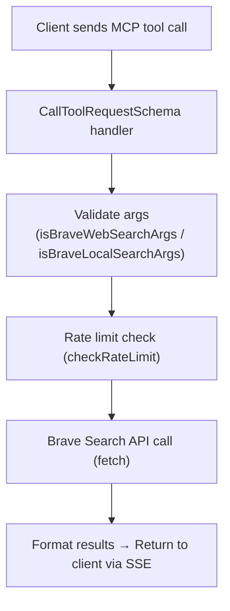

# Onboarding Guide — Brave Search MCP Server

Welcome! This guide will help you get up to speed with the Brave Search MCP Server project, from initial setup to making your first contribution.

---

## Table of Contents

- [Project Overview](#project-overview)
- [Quick Start](#quick-start)
- [Tech Stack](#tech-stack)
- [Project Structure](#project-structure)
- [Development Workflow](#development-workflow)
- [Understanding the Code](#understanding-the-code)
- [Adding a New Tool](#adding-a-new-tool)
- [Testing](#testing)
- [Documentation Conventions](#documentation-conventions)
- [Common Tasks](#common-tasks)
- [FAQ](#faq)

---

## Project Overview

The **Brave Search MCP Server** is a Model Context Protocol (MCP) server that provides AI assistants (like Claude or VS Code Copilot) with web and local search capabilities via the Brave Search API.

### What is MCP?

MCP (Model Context Protocol) is an open protocol that allows AI models to safely interact with external tools and data sources. This server implements MCP's tool-calling interface and supports two transport modes:

- **stdio** (default) — Communicates over standard input/output; used by Claude Desktop, VS Code MCP clients, and other stdio-based MCP clients
- **SSE** (Server-Sent Events) — HTTP server mode; useful for reverse proxy deployments and browser-based clients

Set the transport mode via the `MCP_TRANSPORT` environment variable (`stdio` or `sse`).

### What Does This Server Do?

- **Web Search** — General web queries with pagination and filtering
- **Local Search** — Find businesses, restaurants, and services near a location
- **Smart Fallbacks** — Local search falls back to web search when no local results exist

---

## Quick Start

### Prerequisites

- [Node.js](https://nodejs.org/) >= 22
- [Docker](https://www.docker.com/) (optional)
- A [Brave Search API key](https://brave.com/search/api/) (free tier: 2,000 queries/month)

### Setup (5 minutes)

```bash
# 1. Clone the repository
git clone <repo-url>
cd brave-search

# 2. Install dependencies
npm install

# 3. Build TypeScript
npm run build

# 4. Set your API key and start the server
#    Windows (PowerShell):
$env:BRAVE_API_KEY = "your-api-key-here"
npm start

#    Linux / macOS:
export BRAVE_API_KEY="your-api-key-here"
npm start
```

You should see (on stderr):

```
Brave Search MCP Server running on stdio
```

### Verify It Works

```bash
# Test with an MCP client (stdio mode — default)
# Connect Claude Desktop, VS Code, or another stdio-based MCP client

# Or start in SSE mode and test the HTTP endpoint:
MCP_TRANSPORT=sse npm start

# In another terminal:
curl -i http://localhost:3000/sse
```

---

## Tech Stack

| Layer | Technology | Purpose |
|---|---|---|
| **Language** | TypeScript 5.3+ | Type-safe code |
| **Runtime** | Node.js 22 | Server runtime |
| **Protocol** | `@modelcontextprotocol/sdk` | MCP protocol implementation (stdio + SSE transports) |
| **HTTP Server** | Express 4.x | SSE transport layer (when `MCP_TRANSPORT=sse`) |
| **External API** | Brave Search API | Web and local search |
| **Testing** | Node.js built-in test runner | Unit tests for rate-limit store |
| **Container** | Docker (Alpine) | Production deployment |
| **CI/CD** | GitHub Actions | Automated build & test |

---

## Project Structure

```
brave-search/
├── .github/
│   └── workflows/
│       └── ci.yml              # GitHub Actions CI pipeline
├── docs/
│   ├── AddQueueToBraveWebSearch/
│   │   ├── FEAT_AddQueueToBraveWebSearch.md    # Feature spec
│   │   └── PLAN_AddQueueToBraveWebSearch.md    # Implementation plan
│   └── PersistentRateLimiting/
│       └── PLAN_PersistentRateLimiting.md      # Persistent rate-limit plan (completed)
├── src/
│   └── rate-limit-store.ts     # Persistent rate-limit store (file-backed)
├── tests/
│   └── rate-limit-store.test.ts # Unit tests for rate-limit store
├── .gitignore
├── Dockerfile                  # Multi-stage Docker build
├── index.ts                    # Main entry point (server + tools)
├── package.json                # Dependencies & scripts
├── README.md                   # Project overview & usage
├── DEVOPS.md                   # DevOps & deployment guide
├── ONBOARDING.md               # This file
└── tsconfig.json               # TypeScript configuration
```

### Key Files

| File | What to Know |
|---|---|
| `index.ts` | **Main file** — Contains server setup, tool definitions, API calls, rate-limit integration, and result formatting |
| `src/rate-limit-store.ts` | Persistent rate-limit store — file-backed JSON with periodic flush |
| `tests/rate-limit-store.test.ts` | Unit tests for the rate-limit store (Node.js built-in test runner) |
| `Dockerfile` | Two-stage build: builder (full deps + compile) → release (production only) |
| `tsconfig.json` | TypeScript config — targets ES2020, outputs to `dist/` |
| `package.json` | Scripts: `build`, `start`, `test`; dependencies listed |

---

## Development Workflow

### Making Changes

```bash
# 1. Create a feature branch
git checkout -b feat/your-feature-name

# 2. Make your changes in index.ts (or new files)

# 3. Build and test locally
npm run build
npm start

# 4. Commit with Conventional Commits
git add .
git commit -m "feat: add new search filter option"

# 5. Push and open a PR
git push origin feat/your-feature-name
```

### Conventional Commits

We follow [Conventional Commits](https://www.conventionalcommits.org/):

| Type | Example |
|---|---|
| `feat` | `feat: add image search tool` |
| `fix` | `fix: handle empty API response` |
| `refactor` | `refactor: extract rate limiter to module` |
| `docs` | `docs: update onboarding guide` |
| `chore` | `chore: update dependencies` |

---

## Understanding the Code

### How `index.ts` Works

The file is organized in this order:

1. **Imports** — MCP SDK, Express, and the persistent rate-limit store (`src/rate-limit-store.ts`)
2. **Tool Definitions** — `WEB_SEARCH_TOOL` and `LOCAL_SEARCH_TOOL` objects (MCP schema)
3. **Server Setup** — MCP server creation with tool capabilities
4. **API Key Validation** — Checks `BRAVE_API_KEY` at startup
5. **Rate Limiting** — File-backed persistent store (configurable per-month limit, per-second delay)
6. **Type Interfaces** — `BraveWeb`, `BraveLocation`, etc.
7. **Search Functions** — `performWebSearch()`, `performLocalSearch()`, helper functions
8. **Tool Handlers** — MCP request handlers (`ListToolsRequestSchema`, `CallToolRequestSchema`)
9. **Transport Router** — Detects `MCP_TRANSPORT` env var; starts stdio transport (default) or SSE/Express server
10. **Graceful Shutdown** — Flushes rate-limit state on SIGTERM/SIGINT

### Data Flow



### Key Concepts

- **Dual Transport** — The server auto-detects the transport mode from `MCP_TRANSPORT`. stdio is the default (for MCP clients); SSE is available for HTTP-based deployments
- **Tool Schema** — Each tool defines its name, description, and input parameters (JSON Schema)
- **Persistent Rate Limiting** — Prevents exceeding Brave API quotas using a file-backed store (`src/rate-limit-store.ts`). State is flushed periodically and on graceful shutdown. Configurable via `RATE_LIMIT_PER_MONTH`, `RATE_LIMIT_REQUEST_DELAY_MS`, and other env vars
- **stderr Logging** — All startup/status messages go to stderr to keep stdout clean for JSONRPC protocol communication

---

## Adding a New Tool

To add a new MCP tool (e.g., image search):

### 1. Define the Tool Schema

```typescript
const IMAGE_SEARCH_TOOL: Tool = {
  name: "brave_image_search",
  description: "Searches for images using the Brave Search API.",
  inputSchema: {
    type: "object",
    properties: {
      query: {
        type: "string",
        description: "Image search query"
      },
      count: {
        type: "number",
        description: "Number of results (1-20, default 10)",
        default: 10
      },
    },
    required: ["query"],
  },
};
```

### 2. Add the Tool to the List

```typescript
server.setRequestHandler(ListToolsRequestSchema, async () => ({
  tools: [WEB_SEARCH_TOOL, LOCAL_SEARCH_TOOL, IMAGE_SEARCH_TOOL],
}));
```

### 3. Add a Handler Case

```typescript
case "brave_image_search": {
  // Validate args, call API, format results
  const results = await performImageSearch(query, count);
  return {
    content: [{ type: "text", text: results }],
    isError: false,
  };
}
```

### 4. Implement the Search Function

```typescript
async function performImageSearch(query: string, count: number = 10) {
  checkRateLimit();
  // ... fetch from Brave API, format results
}
```

---

## Testing

### Current State

The project uses Node.js's built-in test runner (`node --test`) for unit tests. Tests are located in `tests/`.

### Running Tests

```bash
# Run all tests
npm test

# The test command runs: node --test dist/tests/*.test.js
```

### Current Test Coverage

- **Rate Limit Store** (`tests/rate-limit-store.test.ts`) — Tests for `increment()`, `flush()`, `loadState()`, `getRemainingQuota()`, timer management, and state persistence

### Planned Test Improvements

- **Framework:** Vitest (planned per [PLAN_AddQueueToBraveWebSearch.md](./docs/AddQueueToBraveWebSearch/PLAN_AddQueueToBraveWebSearch.md))
- **Additional Coverage:** Queue logic, tool argument validation, API error handling

```bash
# Start the server
npm run build && npm start

# Test via curl or an MCP client
curl -i http://localhost:3000/sse
```

---

## Documentation Conventions

### Feature Proposals

New features follow a two-document pattern in `docs/`:

| Document | Purpose |
|---|---|
| `FEAT_<FeatureName>.md` | Short feature description and TODO list |
| `PLAN_<FeatureName>.md` | Detailed phased implementation plan |

### Code Comments

- Use JSDoc-style comments for public functions
- Keep inline comments concise and explain *why*, not *what*

---

## Common Tasks

### Install a New Dependency

```bash
# Runtime dependency
npm install <package-name>

# Dev dependency
npm install --save-dev <package-name>
```

### Change the Server Port

```bash
PORT=8080 npm start
```

### Debug API Responses

Add a temporary `console.log` in the search functions:

```typescript
const data = await response.json() as BraveWeb;
console.log("DEBUG API Response:", JSON.stringify(data, null, 2));
```

### Update TypeScript Configuration

Edit `tsconfig.json` — key settings:

- `target`: JavaScript output version (currently `ES2020`)
- `outDir`: Compiled output directory (currently `./dist`)
- `strict`: Strict type checking (enabled)

---

## FAQ

### Q: Why is most of the code in `index.ts`?

The project started as a single-file implementation. The rate-limit store has been extracted to `src/rate-limit-store.ts`. A full refactor into a modular `src/` structure (tools, queue, types, config) is planned (see [PLAN_AddQueueToBraveWebSearch.md](./docs/AddQueueToBraveWebSearch/PLAN_AddQueueToBraveWebSearch.md), Phase 2).

### Q: Can I run this without Docker?

Yes. Run `npm run build && npm start` with `BRAVE_API_KEY` set.

### Q: How do I get a Brave API key?

Sign up at [brave.com/search/api/](https://brave.com/search/api/) and generate a key from the [developer dashboard](https://api-dashboard.search.brave.com/app/keys). The free tier includes 2,000 queries/month.

### Q: What's the difference between web search and local search?

- **Web search** — General queries, articles, news (like a search engine)
- **Local search** — Businesses, restaurants, services with addresses, hours, ratings (like Google Maps)

### Q: How does the rate limiter work?

A file-backed persistent store (`src/rate-limit-store.ts`) tracks requests per second (configurable delay, default 1000ms) and per month (default 1,000, configurable via `RATE_LIMIT_PER_MONTH`). State is persisted to `.rate-limit-state.json` and flushed periodically. This is a client-side safeguard — the Brave API also enforces its own limits.

### Q: What's the difference between stdio and SSE transport?

- **stdio** — The server reads JSONRPC messages from stdin and writes responses to stdout. This is the standard way MCP clients (Claude Desktop, VS Code, etc.) connect. Set `MCP_TRANSPORT=stdio` or leave it unset (default).
- **SSE** — The server starts an HTTP Express server that clients connect to via `/sse` (for events) and `/message` (for requests). Useful behind a reverse proxy. Set `MCP_TRANSPORT=sse`.

### Q: Why does the server log to stderr instead of stdout?

MCP's stdio transport uses stdout for JSONRPC protocol messages. Any non-JSON text on stdout corrupts the protocol stream. Logging to stderr keeps the protocol clean while still showing status messages in the terminal.

---

## Next Steps

1. ✅ Read this onboarding guide
2. ✅ Set up your local environment
3. 🔲 Explore `index.ts` and `src/rate-limit-store.ts` to understand the architecture
4. 🔲 Run the test suite: `npm test`
5. 🔲 Pick a task from the [planned features](./docs/AddQueueToBraveWebSearch/PLAN_AddQueueToBraveWebSearch.md) or propose your own
6. 🔲 Create a feature branch and start coding!
